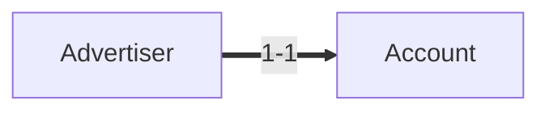
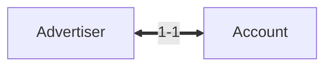
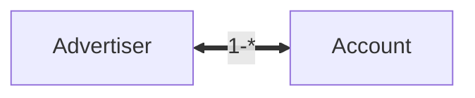
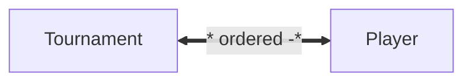
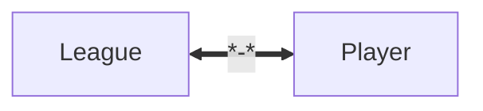
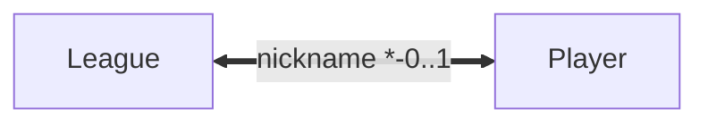

<style>
  * {
    line-height: 1.8;
  }
  body {
    padding: 24px;
    max-width: 720px;
    margin: auto;
  }
  .img-container {
  	display: flex;
    flex-direction: row;
    width: 100%;
    gap: 1rem;
  }
  .img-container img {
    object-fit: contain;
    flex: 1;
    overflow: hidden;
  }
</style>

# 2110336 SOFTWARE ENG II - Final Summary <!-- omit in toc -->

สรุป Final วิชา 2110336 Software Engineering II โดย แสนยากร เสียงเสนาะ

ปล. เอาจริง ๆ ไม่ควรจะเรียกว่า Summary เพราะ detail มากเกินไป อีกเรื่องหนึ่งคือน่าจะมีพิมพ์ผิดเยอะด้วยความรีบ หรืออาจจะมีจุดที่ไม่ค่อยเคลียร์ หากเจอโปรดแจ้งให้ทราบด้วย

## Course Playlist <!-- omit in toc -->

<a href='https://youtu.be/dQw4w9WgXcQ' style="margin-right:2em">
  Playlist 1
</a>

<a href='https://youtube.com/playlist?list=PLzFuNE9WxQxguQdEsvGT0IPBDbvVcCFGF'>
  Playlist 2
</a>

# Examination Contents <!-- omit in toc -->

Part A (10 points)

- [Bad Smell and Refactoring](#bad-smell-and-refactoring)

- [Map to code](#map-to-code)

- [UML Profile for REST API](#uml-profile-for-rest-api)

Part B (25 points)

- [Software Testing](#software-testing)

Part C (25 points)

- [CI/CD](#cicd)

- [Docker](#docker)

- [Design for security](#design-for-security)

Part D (10 points)

- [Software Configuration Mangement](#software-configuration-mangement)

- [Software Maintenance](#software-maintenance)

# Table of Contents <!-- omit in toc -->

- [Bad Smell and Refactoring](#bad-smell-and-refactoring)
  - [Duplicate Code](#duplicate-code)
  - [Long Method](#long-method)
  - [Temporary Variables](#temporary-variables)
  - [Long Parameter List](#long-parameter-list)
  - [Large Class](#large-class)
  - [Feature Envy](#feature-envy)
  - [Lazy Class](#lazy-class)
  - [Middle Man](#middle-man)
  - [Data Class](#data-class)
  - [Comment](#comment)
- [CI/CD](#cicd)
  - [DevOps Culture](#devops-culture)
      - [CALMS For DevOps](#calms-for-devops)
    - [Devtools](#devtools)
- [Docker](#docker)
  - [Compare to Virtual Machine](#compare-to-virtual-machine)
  - [Host Port vs Container Port](#host-port-vs-container-port)
- [Design for Security](#design-for-security)
- [Software Testing](#software-testing)
  - [White-box Testing](#white-box-testing)
    - [Coverage Criteria](#coverage-criteria)
    - [Control Flow Graph](#control-flow-graph)
      - [McCabe's Cyclomatic Complexity (C)](#mccabes-cyclomatic-complexity-c)
  - [Black-box Testing](#black-box-testing)
    - [Equivalence classes partitioning](#equivalence-classes-partitioning)
    - [Boundary value analysis](#boundary-value-analysis)
    - [Decision Table](#decision-table)
  - [Verification & Validation](#verification--validation)
  - [Strategy](#strategy)
    - [Unit Test](#unit-test)
    - [Integration Test](#integration-test)
    - [System Testing](#system-testing)
      - [Requirement-based Functional Tests](#requirement-based-functional-tests)
    - [Acceptance Testing](#acceptance-testing)
    - [Alpha Test](#alpha-test)
    - [Beta Test](#beta-test)
    - [Regression Test](#regression-test)
- [Software Configuration Mangement](#software-configuration-mangement)
  - [Sources of Changes](#sources-of-changes)
  - [Baselines](#baselines)
  - [Software Configuration Items](#software-configuration-items)
  - [Baseline SCIs](#baseline-scis)
  - [Identification of Object in the Software Configuration](#identification-of-object-in-the-software-configuration)
  - [Change Control Process](#change-control-process)
  - [Software Configuration Audit](#software-configuration-audit)
- [Software Maintenance](#software-maintenance)
  - [Corrective Maintenace](#corrective-maintenace)
  - [Adaptive Maintenace](#adaptive-maintenace)
  - [Perfective Maintenace](#perfective-maintenace)
  - [Preventive Maintenace](#preventive-maintenace)
  - [Who perform maintenance](#who-perform-maintenance)
- [Map to code](#map-to-code)
  - [Optimizing the Object Desing Model](#optimizing-the-object-desing-model)
  - [Mapping Association to Collections](#mapping-association-to-collections)
  - [Summary](#summary)
- [UML Profile for REST API](#uml-profile-for-rest-api)

<!-- ############################################# -->

## Bad Smell and Refactoring

> Refactoring คือการจัดเรียงหรือจัดระเบียบ code ใหม่ เพื่อป้องกันปัญหาที่อาจจะเกิดในอนาคต โดยเมืื่อแก้แล้วจะระบบจะต้องสามารถทำงานได้เหมือนเดิม

> Bad Smell (Code Smell) คือเมื่อตรวจสอบ source code แล้วได้กลิ่นแปลก ๆ (สิ่งที่อาจจะก่อให้เกิดปัญหาในอนาคต) เมื่อพบแล้วจะต้องทำ refactoring ต่อไป

Bad Smell ถูกนิยามไว้ 22 แบบและ Refactoring ถูกนิยามไว้ 72 แต่จะเรียนแค่บางแบบดังนี้

<div style="page-break-after: always;"></div>

### Duplicate Code

<div class="img-container">
  
  
</div>

"กลิ่นแรงสุด"

คือการเขียน code ซ้ำกันหลาย ๆ แห่ง

แก้ได้ด้วย **Extract Method**

> **Extract Method** คือวิธีการนำ code ที่ซ้ำกัน แยกออกเป็น Method ใหม่แล้วเรียกใช้ Method นี้แทน

```py
sum_a = 0
for i in range(len(arr_a)):
  sum_a += arr_a[i]

sum_b = 0
for i in range(len(arr_b)):
  sum_b += arr_b[i]
```

แก้เป็น

```py
# extracted function/method
def get_sum(arr):
  s = 0
  for i in range(len(arr))
    s += arr[i]
  return a

sum_a = get_sum(arr_a)
sum_b = get_sum(arr_b)
```

### Long Method

<div class="img-container">
  
  
</div>

คือ method หรือ function ที่ยาวมาก ๆ (ยาวมากแค่ไหนขึ้นอยู่กับผู้เขียน) ส่วนมากจะพิจารณาโดยคำนึงเรื่อง maintenance

หนึ่ง function / method ควรทำหน้าที่แค่อย่างเดียว

แก้ได้โดนการใช้ **Extract Method**

> **Extract Method** คือวิธีการนำ code ที่ซ้ำกัน แยกออกเป็น Method ใหม่แล้วเรียกใช้ Method นี้แทน

### Temporary Variables

คือมีการใช้ตัวแปรชั่วคราวมากเกินไป อาจทำให้เกิด dependency ได้

แก้ได้โดนการใช้ **Replace Temp With Query**

> **Replace Temp With Query** คือการแทนที่ด้วยการ call ไปเลยไม่ต้องมีตัวแปรชั่วคราว

```py
basePrice = quantity * itemPrice
if basePrice > 1000: return basePrice * 0.95
return basePrice * 0.98
```

แก้เป็น

```py
if getBasePrice() > 1000: return getBasePrice() * 0.95
return getBasePrice() * 0.98
```

แต่อาจเกิดปัญหาเรื่อง Performance เพราะต้อง query ของเดิมซ้ำ ๆ

### Long Parameter List

<div class="img-container">
  
  
</div>

คือ method มี parameter เยอะเกินไป ซึ่งยากต่อการใช้งาน

แก้ได้โดนการใช้ **Introduction Parameter Object** หรือ **Replace Parameter With Method**

> **Introduction Parameter Object** คือการเอา parameter รวมกันเป็น object

> **Replace Parameter With Method** คือการตัด parameter บางอย่างออกแล้วไปคำนวณข้างในแทน

```py
price = quantity * itemPrice
discountLevel = getDiscountLevel(price)
finalPrice = discountedPrice(price, discountLevel)
```

```py
price = quantity * itemPrice
finalPrice = discountedPrice(price)

def discountedPrice(price):
  discountLevel = getDiscountLevel(price)
  # ...
```

### Large Class

<div class="img-container">
  
  
</div>

คือคลาสใหญ่เกินไป มีหลาย method และตัวแปรมากเกินไป

แก้ได้โดนการใช้ **Extract Class**

> **Extract Class** คือวิธีการนำ methods / variables ที่ไม่ค่อยเกี่ยวข้องกันแยกออกไปเป็น class หรือ class ย่อย

### Feature Envy

<div class="img-container">
  
  
</div>

คือ method ใน class A ไปเรียกใช้ method ใน class B ทำให้ method ใน class A รู้สึก "อิจฉา"

แก้ได้โดนการใช้ **Move Method**

> **Move Method** คือการย้าย method ที่มีการเรียก method จาก class อื่นเยอะ ๆ ให้ย้ายไปเป็น method ของ class นั้นแทนเลย

### Lazy Class

<div class="img-container">
  
  
</div>

คือ class ที่ไม่ค่อยได้ทำอะไร

แก้ได้โดนการใช้ **Collapse Hierachy**

> **Collapse Hierachy** คือรวมเข้ากับคลาสที่ inherit มา

### Middle Man

<div class="img-container">
  
  
</div>

โดยทั่วไป middle man หมายถึงคนกลาง ทำหน้าที่รับ จากนั้นแปลง แล้วค่อยส่งต่อ (อันนั้นจะเรียกว่า Adaptor) แต่บางทีอาจจะมี middle man ที่ไม่ได้ทำอะไรมากมายขนาดนั้น

แก้ได้โดนการใช้ **Remove Middle Man**

> **Remove Middle Man** ก็คือให้มันต่อตรงเลย แล้วลบ middle man ออก

### Data Class

data class คือ class เก็บแต่ attributes หรือมีแต่ getter / setter

"กลิ่นน้อย"

เป็น bad smell ที่ data class มีหน้าที่อย่างอื่นมากกว่าแค่เก็บตัวแปร

แก้ได้โดนการใช้ **Extract/Move Method**

### Comment

"กลิ่นน้อย"

คือ comment ทั่ว ๆ ไป แต่ถ้าหากมี comment นั่นหมายความว่ามันเริ่มซับซ้อนแล้ว นั่นคือจุดที่เราสามารถ extract ได้

แก้ได้โดนการใช้ **Extract Method/Variable**

<!-- ############################################# -->

## CI/CD

> **CI (Continuous Integration)** - ช่วยเรื่องการ build และ test ด้วย automation ซึ่งทำได้บ่อย ๆ และช่วยให้ได้ feedback จาก user ได้เร็วขึ่้น รวมถึงสามารถหาบัคได้เร็วขึ้นด้วย รวมกันเป็น Agile Menifesto (สรุป คือ Build, Test, Merge)

> **CD (Countinuos Delivery)** - หลังจากผ่าน​ CI แล้วจะส่ง Code ที่ตรวจสอบ (หรือเรียกว่า Change) แล้วเข้าไปที่ Repository และ Deploy ขึ้น Production ได้เลย แต่ทีม Developer สามารถเลือกได้ว่าจะเอาขึ้นหรือไม่ขึ้น

> **CD (Countinuos Deployment)** - ขยายมาจาก Countinuos Delivery คือทำหน้าที่ Deploy Code จาก Repository ขึ้นไปบน Production Environment แบบอัตโนมัติสำหรับทุก Change

### DevOps Culture

คือการร่วมมือกันของ Dev กับ Ops โดย Developer จะหมายถึงคนเขียน Code และ Operator จะหมายถึงคนทำหน้าที่ Deploy ซึ่งโดยส่วนมาก เมื่อก่อน Dev กับ Ops ทำงานไม่คุยกัน ทำงานแบบ Silo ทำให้ทำงานได้ช้า ดังนั้นการทำ DevOps เลยพ่วงมากับการทำ CI/CD ด้วย


##### CALMS For DevOps

1. Culture
   1. Collaboration
   2. Cross-functional Collaboration
2. Automation
   1. CD
   2. Automation Tests
   3. Automation deploys
   4. Configuration as Code (GitOps)
3. Lean
   1. Continuous Improvement
   2. Begin Agile
   3. Eliminate low-value activities
   4. Embracing failure
4. Messurement
   1. How long dev to deploy?
   2. How often detech bug and failure?
   3. How many using our product?
5. Sharing
   1. Sharing knowlegde and problems

#### Devtools

มีให้ใช้หลายอย่างมาก แต่การใช้จะได้ทั้งทีมต้องมี mindset แบบ DevOps เสียก่อน!!!

<!-- ############################################# -->

## Docker

อ้างอิง [CI/CD](#cicd) เรื่อง Docker จะเกี่ยวข้องกับ Phase **Deploy and Operate**

เวลาจะ build app ด้วย Docker เวลาเราสั่ง `docker build .` มันจะไปอ่าน Dockerfile จากนั้นก็จะ execute ทีละคำสั่งใน Dockerfile (เรียกว่า Layer) จากนั้นจะได้ Docker Image ออกมา

จากนั้นเราจะสามารถเอา Docker image ไปรับจริง ๆ บนเครื่องของเราได้ ด้วย `docker run <image-name>` ซึ่งจะได้ออกมาเป็น Docker container

นอกจากนี้เราสามารถเอา Docker image ไปขึ้น Hub เช่น Docker Hub, Github Container Registry ได้เพื่อให้คนอื่น ๆ มาใช้ image เราได้

Docker ช่วยให้เราสามารถรัน App โดยได้ผลลัพธ์เหมือน ๆ กันโดยไม่ขึ้นอยู่กับ OS ของ Host หรือก็คือเราสามารถเอา Docker image ไปรันได้ในหลาย ๆ Host Environment และไม่ต้อง Configure Host เลย

### Compare to Virtual Machine


หลัก ๆ จะต่างกันตรงที่ Docker container จะรันบน Docker daemon ซึ่งต่อกับ Host OS โดยตรง ในขณะที่ VM จะสร้าง Guest OS (ของใครของมัน) ขึ้นมาและเอา app ไปรันบน Guest OS นั้นซึ่งใช้ทรัพยากรมากกว่า

### Host Port vs Container Port


จากรูป จะหมายความว่า Container Apache expose port 80 อยู่และ Container MySQL expose port 3306 ซึ่งเรียกอันนี้ว่า Container Port โดย user ได้ทำการ map Host Port 8080 ไปที่ Container Apache Port 80 และ map Host Port 6603 ไปที่ Container MySQL Port 3306

ดังนั้นโดยผลลัพธ์ user สามารถเข้าถึง Apache ได้ด้วย Host Port 8080 (e.g. localhost:8080) และ MySQL ได้ด้วย Host Port 6603 นั่นเอง (e.g. localhost:6603)

> นอกจากนี้ ถ้าอยากให้แต่ละ Container คุยหากันได้ ทั้งสองอันจะต้องอยู่ใน **Network** อันเดียวกัน

<!-- ############################################# -->

## Design for Security

from Martin Fowler

1. Reject unexpected form input
   1. Untrusted input
      1. ใช้ form หรือไม่ และใช่ HTTPS หรือเปล่า
      2. ส่ง data ไม่คาดฝันจาก curl ได้ป่าว
   2. Input Validation
      1. ได้ตรวจสอบ input ก่อนใช้งานหรือเปล่า
      2. ถ้า input fail ต้องแสดงยังไง บอก user ว่าอะไร
   3. In Practice (Blacklisting)
      1. ทำ blacklist อันไหนอันตราย reject ให้หมด
   4. In Summary
      1. ทำ whitelist ถ้าทำได้
      2. ถ้าไม่ได้ให้ blacklist
      3. ให้มีการแจ้งเตือนเมื่อถูกบุกรุก
      4. พยายาม reject bad input ให้เร็วที่สุด
      5. ไม่งั้นอาจโดน **XSS (Cross Site Scripting)** ได้
2. Encode HTML output
   1. การ render markup ที่ไม่ถูกต้องจะเกี่ยวกับความปลอดภัยด้วย
   2. ควรจะทำการ encode อักขระต่าง ๆ ให้เหมาะสม
      ```
      document.getElementById('name') = 'Sandra Day O' Connor' // unescapted string
      ```
   3. Caution and caveat (ข้อควรระวังและข้อแม้)
      1. เลือก framework ที่เกี่ยวกัย safe output function
      2. เอา output ดิบ ๆ ไป encode ก่อน
   4. In Summary
      1. ส่งออกข้อมูลที่ encode ใฟ้ถูกต้อง
      2. ใช้ framework ที่สนับสนุน
3. Bind parameters for database queries

   1. ระวังข้อมูลถูกขโมยผ่าน input ที่อันตราย

      ```java
      String query = "INSERT INTO students (last_name, first_name) VALUES ('" + lastName + "','" + firstName + "')'";
      ```

      ถ้า firstName เป็น `Robert'); DROP TABLE students; --` table student ก็จะหายไปเลย เรียกว่า **SQL injection**

   2. Parameter Binding

      ```java
      PreparedStatement stmt = "INSERT INTO students (last_name, first_name) VALUES (?, ?)'";

      stmt.setString(1, lastName) // binding
      stmt.setString(2, firstName) // binding
      ```

      clean and safe code

   3. Common Misconceptions
      1. บาง statment ยังเป้นช่องทางอันตรายอยู่เช่น `$where`
   4. In Summary
      1. หลีกเลี่ยงการสร้างคำสั่ง SQL / NoSQL จาก input ตรง ๆ
      2. ให้ทำ parameter binding
      3. อย่าคิดว่า ORM ปลอดภัย 100%

4. Protech Data in transits

   1. ระหว่าง Client & Server ถ้าไม่มีการเข้ารหัสอาจเกิดปัญหาได้เช่น
      1. ถูกดักจับข้อมูล
      2. ถูกรุกรานแบบ man-in-th-middle (MITM)
      3. อาจจะโดนจาก Free WIFI ได้
   2. อาจเพิ่มความปลอดภัยได้จาก

      1. TLS (Transport Laver Secure)
      2. HTTPS ซึ่งต้องไปขอ server certificate -> ได้จาก Registration Authority -> Certificate Agent แล้วจะได้ certificate, public key, and private key แล้วเก็บไว้ใน Server จากนั้นเวลามี request จาก Client, Server จะส่ง signed data ที่ถูก encrypt ด้วย private key ไปให้ Client แล้วให้ Client ไปถาม Verification Authority ว่าตรงกับที่มีข้อมูล public key ของ Server ในนั้นไหม

      

      1. CA มีหลายระดับ
         1. Domain validation - ถูกสุด ไว้ดูว่าเราเป็นเจ้าของ domain จริงป่าว
         2. Organization validation
         3. Extened validation

   3. ใช้ HTTPS กับทุกที่
   4. HSTS (HTTP Strict Transport Secure)
      1. ใช้เพื่อให้บังคับให้ Browser ส่ง request มาผ่าน HTTPS เท่านั้น
      2. หลาย ๆ browser ฉลาดพอที่จะเปลี่ยน HTTP เป็น HTTPS ให้เอง
      3. ใข้แล้วยกเลิกกลางคันไม่ได้ ต้องรอหมดอายุ
   5. Protect Cookie
      1. Browser หลาย ๆ อันบังคับให้รับส่ง Cookie ด้วย HTTPS แล้ว
      2. ใส่ option `Secure`, `HttpOnly` เพื่อให้ส่งผ่าน HTTPS และ ไม่ให้ javascript ดึงข้อมูล Cookie ได้ตามลำดับ
   6. Cache Control
      1. `no-cache` คือต้อง revalidate ทุกครั้งที่จะใช้
      2. `no-store` คือไม่ต้องเก็บเลย
      3. `must-revaludate` คือ local ใช้ได้จนกระทั่งหมดอายุแล้วค่อย revalidate
   7. Verify security
      1. [ssllab](https://www.ssllabs.com/ssltest)
   8. In Summary
      1. HTTPS everywhere
      2. HSTS if possible
      3. ได้ certificate จาก CA ที่น่าเชื่อถือ
      4. เก็บ private key ให้ดีสุด ๆ
      5. อย่าลืม Cookie Secure

5. Hash and salt username / password
   1. Always hash your password
   2. เติม salt (เติมหน้า password) ให้ bruce force ยาก ๆ
   3. OAuth ก็ใช้ได้
   4. OWASP แนะนำว่า password ไม่ควรเกิน 100 อักขระ
6. Authentication and Authorization
   1. Authentication คือการยืนยันตัวตน
   2. Authorization คือการตรวจสอบว่าผู้ใช้คนนั้นมีสิทธิหรือเปล่า
   3. Reauthenticate จำเป็นสำหรับอะไรที่ sensitive เช่น โอนเงินต้องใส่ password ใหม่
   4. ถ้า username / password ผิด อย่าบอกว่าผิดอะไร
   5. ป้องกันการ Bruce force ด้วย
   6. อย่า Hard code password ลง database!!
7. Protect User Session
   1. อย่า expose session id
   2. Protect Cookies
   3. Manage session life cycle - คือต้องมีการเกิด/แก่/เจ็บ/ตาย ภายในเวลาเท่าไร

<!-- ############################################# -->

## Software Testing

> **Testing** คือกระบวนการเพื่อดูว่าเป็นไปตาม requirement หรือเปล่า ตรงกับความคาดหวังหรือเปล่า

Test Case ประกอบไปด้วย input และ expected output

> **Error (Mistake)** หมายถึงสิ่งที่ software developer เข้าใจผิดหรือพลาดไป

> **Fault/Defect/Bug** หมายถึงความผิดพลาดที่แสดงออกมาจาก Software

### White-box Testing

มีอีกชื่อว่า glass-box / structural testing

คือเราจะ**เห็นโครงสร้าง**ของ Code ทั้งหมด และสร้าง test case **ตามที่เห็น**

#### Coverage Criteria

1. Statement coverage - statement (คำสั่ง) ถูก execute เท่าไรจากทั้งหมด
2. Branch coverage - ทุก branch จะต้อง traverse อย่างน้อย 1 ครั้ง (ทุก ๆ true / false ของทุก decision จะต้องถูก exercise อย่างน้อย 1 ครั้ง)
3. Path coverage - ทุก possible path จากเริ่มไแจบ จะต้องถูก execute อย่างน้อย 1 ครั้ง

#### Control Flow Graph

1. Circle (node) - program statements (รวบได้บางกรณี)
2. Arrtow (edge) - flow of control คือ execute node นี้แล้วไปไหนต่อ
3. Regoin - บริเวณที่ถูกล้อมโดย node และ edge


##### McCabe's Cyclomatic Complexity (C)

> C = #edges - #nodes + 2

> C = #regions + 1

C คือควาซับซ้อนของ code ยิ่งซับซ้อนมาก ยิ่ง test ยาก
C คือ lower bound number ของ independent path (ทางเดินที่มีอย่างน้อย 1 edge ที่ยังไม่เคยถูก traverse มาก่อน)

> White-box ไม่สามารถดูว่ามันทำงานได้ตาม requirement หรือไม่

### Black-box Testing

คือเราจะ**ไม่เห็นโครงสร้าง**ของ Code เลย และสร้าง test case ตาม **requirement**

#### Equivalence classes partitioning

การแบ่ง input / ouptut (ส่วนมากเป็น input) ออกเป็น set ของ equivalence class เช่น แบ่ง input เป็น 3 class ดังนี้ แล้วเลือกของมาแค่ 1 element ใน class มา test

```txt
EC: X < 0 (Invalid)
EC: X > 200 (Invalid)
EC: 0 <= X <= 200 (Valid)
```

#### Boundary value analysis

เอาค่า "ริมขอบ" มาใช้เป็นตัว test ได้แก่ `min-`, `min`, `min+`, `max-`, `max`, `max+`

เช่นช่วงที่ valid อยู่ที่ 0 <= x <= 200 จะได้ค่า test ดังนี้ `min- = -1`, `min = 0`, `min+ = 1`, `max- = 199`, `max = 200`, `max+ = 201`

#### Decision Table

ประกอบไปด้วย 4 ส่วน

1. condition (condition stubs) - เงื่อนไข input ของ program
2. rules (condition entires) - set ของค่าของ condition
3. actions (action stubs) - ผลลัพธ์ที่คาดหวัง
4. set of actions (action entires) - set ของค่าของ action

มี 2 แบบ

1. Limited entry คือ condition ทั้งหมดเป็น binary
2. Extended entry คือ condition ทั้งหมดเป็นได้หลายค่า


ปล. ควรจะมี error message ใน action ด้วย

> Black-box ไม่สามารถดูว่ามีบางส่วนของ code ที่ยังไม่ได้ทดสอบหรือเปล่า

### Verification & Validation

> Verification คือกิจกรรมที่ทำให้มั่นใจว่า program ถูก implement แล้วถูกต้อง แต่ไม่รู้ว่าตรงตาม requirement ไหม

> Validation คือกิจกรรมที่ทำให้มั่นใจว่า program เป็นไปตาม requirement

> Verification -> build the product right

> Validation -> build the right product

### Strategy

#### Unit Test

คือการทดสอบหน่วนที่เล็กที่สุดที่จะทดสอบได้ เช่น function / class โดยในการทดสอบจะมีส่วนที่เรียกว่า **driver** มาเป็นตัวใช้ทดสอบ unit ที่เราสนใจ หาก unit นี้มีการ import unit อื่นมาใช้ เราจะเรียก unit พวกนั้นว่า **stub** ซึ่งจะต้องทำการ mock ก่อน

#### Integration Test

คือการทดสอบเมื่อเอา unit หลาย ๆ อันมารวมกัน

1. Incremental Approaches
   1. **top-down** - จะเริ่มทำการทดสอบจากข้างบนก่อน โดยมีทั้งแบบ depth first และ breadth first โดยค่อย ๆ เริ่มที่หน่วย ๆ แบบ incremental (เริ่มจาก A จากนั้น AB จากนั้น ABC)
   2. **bottom-up** - ให้เทสเป็น cluster แล้วค่อย test จากล่างขึ้นบน จากนั้นค่อยมา integrate กันแล้ว test จากล่างขึ้นบนอีกที
   3. **sandwich** - ทำ top-down และ bottom-up สลับกันแล้วมาชนกันตรงกลาง

#### System Testing

มีหลายอย่างมาก แต่ในวิชานี้เราจะสนใจ

1. Requirement-based Functional Tests - จะเป็นการ demonstrate ว่าทุกฟังก์ชันทำงานได้ตาม requirement ของระบบ
2. Performance Capability Tests - คือการทดสอบข้อจำกัดด้านประสิทธิภาพของระบบว่าตรงกับ requirement หรือไม่ เช่น Long runner
3. Stress or Volume Testing - จำลองว่าในสถาณการณ์ไม่ปกติ system จะพังไหม
4. Recovery Testing - ถ้าระบบเราพังไปแล้ว จะสามารถกู้กลับมาได้หรือเปล่า
5. Security Testing - เอา Access Table มาดูแล้วทดสอบว่า ผู้ใช้ที่มีสิทธิเท่านี้เข้าฟังก์ชันนี้ได้หรือไม่

##### Requirement-based Functional Tests

จะเป็นการ demonstrate ว่าทุกฟังก์ชันทำงานได้ตาม requirement ของระบบ

| Req. No. | Req. Desc    | Test Case ID | staus   |
| -------- | ------------ | ------------ | ------- |
| 1        | ชำระเงิน     | 87,88,89     | P, F, P |
| 2        | จองเวลาเรียน | 81-88,102    |         |

#### Acceptance Testing

คือจะทำเมื่อจะส่งมอบให้กับ Client แล้วโดยเอา test case จาก System Testing มาแสดงให้ Client เห็น ด้วยข้อมูลจริง ซึ่งจะต้องแสดงให้เห็นความสามารถของระบบ จะเสร็จสิ้นเมื่อลูกค้าพอใจ

ปล.​ test นี้จะทำเมื่อมี **"ผู้ว่าจ้าง"** (Facebook / Microsoft ไม่ต้องทำ)

#### Alpha Test

ทำบนฝั่ง developer โดยมร interact กับ user

#### Beta Test

ทำบนฝั่ง consumer มี interact กับ user

#### Regression Test

คือการรัน test ใหม่ทั้งหมด เพื่อป้องกันว่า change ที่เกิดขึ้นจะไม่ไปพังของเก่าที่เคย test ผ่านไปแล้ว

<!-- ############################################# -->

## Software Configuration Mangement

> Configuration ในที่นี้หมายถึงองค์ประกอบ

จะเป็นเรื่องเกี่ยวกับ **"Change"** โดย SCM activities จะมีดังนี้

1. Identify Change - ระบุให้ได้ว่า change เกิดขึ้นที่ไหน
2. Control Change - ควบคุม change
3. Ensure that Change is implemented - เอา change ที่เกิดขึ้นไป implement
4. Report Change - แจ้งว่ามี change เกิดขึ้น

> SCM เกิดตั้งแต่วันแรกของ project จนถึงก่อนส่งมอบ
> SM เกิดหลังส่งมอบ

### Sources of Changes

1. อาจเกิดจากฝั่ง Bussiness หรือ Marketing เพราะสถานการณ์ใด ๆ
2. อาจเกิดจากฝั่ง Customer
3. อาจเกิดจากการเปลี่ยนแปลงขององค์กรของเราหรือลูกค้า
4. อาจเกิดจาก Budget หรือ Scheduling constraint

### Baselines

คือ Specification หรือ Work Product ที่เกิดขึ้นระหว่างที่เราทำระหว่าง process หรือตาม milestone และต้องถูก FTR (Formal Technical Review) ด้วย QA อย่างเป็นทางการ เห็นพ้องต้องกัน

> แต่ Milestone != Baseline เพราะต้อง FTR ก่อน

> Baseline != deliverable work product ขึ้นอยู่กับว่าจะส่งมอบหรือไม่

### Software Configuration Items

อะไรก็ตามท่ี่ถูกผลิดมาระหว่าง Software Engineering Process ที่เราต้อง Control เพราะอาจจะมี Change เกิดขึ้นได้

> เช่น Project Plan, Requirement Spec, Source Code เป็นต้น

> อะไรที่ไม่ใช่ SCIs เช่น Memo, Private Note

### Baseline SCIs

กระบวนการที่ทำให้ SCI กลายเป็น Baseline


> Project Database คือถังที่คนอื่น ๆ สามารถเอาไปใช้วานต่อได้ ถ้าอยากเอามาแก้ไขต้อง extract Baseline ก่อน

### Identification of Object in the Software Configuration

SCI มีอยู่ 2 types ได้แก่

1. Basic Object - Unit of text
2. Aggregate Object - กลุ่มของ Basic object หรือ Aggregate Object

> ต้องระบุ name, type, description และ identifier (version) Major.Minor.Patch

### Change Control Process

1. Change request from user
2. Developer evaluate
3. Generate change report
4. Change control authority decides (Yes / No) ?
5. If yes, make the Change
6. Review/Audit the change
7. Establish "baseline" for testing

### Software Configuration Audit

เป็นการตรวจสอบกระบวนการว่าเป็นไปตามขั้นตอนหรือไม่ ไม่ใช่อยู่ ๆ ก็ change เลย

<!-- ############################################# -->

## Software Maintenance

เกิดหลังจากการส่งมอบ Software

Focus 4 อย่างใหญ่ ๆ

1. ควบคุมหรือคอยเช็ค system day-to-day
2. ควบคุมหรือคอยเช็คการแก้ไข system
3. ทำให้ system สมบูรณ์มากขึ้น
4. ป้องกันไม่ให้เกิดบัคขึ้น

### Corrective Maintenace

เพื่อควบคุมหรือเช็ค system แบบวันต่อวัน ซึ่งหากเกิดปัญหาจะต้องไปหาสาเหตุ และจากนั้นก็แก้ไข code เท่าที่จำเป็น โดยทั่วไปก็จะเป้นการแก้ไข **เอาหน้ารอด** ไปก่อนไม่ใช่ best fix เดี๋ยวระยะยาวจะไปแก้อีกที

> ต้องทำให้เสร็จ

### Adaptive Maintenace

ถ้าเจอปัญหาแล้วต้องรื้ออะไรบางอย่าง ซึ่งกระทบหลาย ๆ จุด ซึ่งเป็นการ change เพื่อจัดการ error ให้เรียบร้อย (มองว่าเป็นการปรับปรุงก็ได้)

### Perfective Maintenace

คือการแก้ไขเพื่อให้ system มีความสมบูรณ์มากขึ้นเพื่อให้ง่ายต่อ developer และดีต่อ user ในอนาคต เช่นการเพิ่ม log จะได้หา error ได้เร็วขึ้นในอนาคต

### Preventive Maintenace

คือเรารู้ว่าแล้วว่าจุดนี้อาจจะเกิดบัคได้ในอนาคตเพราะ test ไม่ครบทุกกรณี เราเลยรีบตาม **เก็บกวาด** ให้เรียบร้อยก่อนเกิด bug ในอนาคต

### Who perform maintenance

ถ้าเป็นทีมเดิมที่ทำ system นี้ แม้ว่าจะคุ้นเคยกับ system แต่ก็อาจจะเกิดอาการ "มั่นใจมากเกินไป" ทำให้บางที้เราก็ไม่ค่อยคิดว่าจะเกิดบัค

คนที่เกี่ยวข้องทั้งหมด

- user, operator หรือ customer

โดยต้องมีคุณสมบัติดังนี้

- เข้าใจ system
- รู้ว่า document ไหนอยู่ที่ไหน
- สามารถหา failure ได้
- และอื่น ๆ

<!-- ############################################# -->

## Map to code

จะแปลงจาก Diagram ไปเป็น Code

### Optimizing the Object Desing Model

1. optimize ส่วนที่เป็นเกี่ยวกับ path ที่ซ้ำซ้อน อันที่ใช้บ่อย ๆ ต้อง path ไม่ยาวมาก
2. many-to-many เยอะไปไหม สามารถยุบรวมได้หรือไม่ (เหมือนหากุญแจในพวงกุญแจ)
   1. พยายามลด Many-to-Many เป็น Many-to-One
   2. แก้โดยการใช้ Modify association คือเพิ่ม index ในด้านที่เป็น many (Hashing)
3. attributes อยู่ไม่ถูกที่
   1. แก้โดยการยุบ class / ย้าย attributes ไปรวมใน class ที่เรียก attributes แทน
4. Collapsing Object คือเปลี่ยน objects ให้เป็น attributes (รวบ object)
5. บางที object ใหญ่มาก แต่เราใช้นิดเดียว อาจจะ delay/skeleton ก่อนจนกว่า actual conent จะมา (เช่นรูปใหญ่มากแต่เราอยากดูแค่ผ่าน ๆ ก็ให้มันแสดง thumbnail ก่อน) โดยใช้ Proxy Design Pattern
6. Caching expensive-computation result เก็บอะไรที่คำนวณหนัก ๆ ไว้เป็น private attributes

### Mapping Association to Collections

1. Unidirectional One-to-One



```java
public class Advertiser {
  private Account account; // consider here
  public Advertiser() {
    this.account = new Account();
  }
}
```

2. Bidirectional One-to-One



```java
public class Advertiser {
  private Account account; // consider here
  public Advertiser() {
    this.account = new Account(this);
  }
}
```

```java
public class Account {
  private Advertiser advertiser; // consider here
  public Account(Advertiser owner) {
    this.advertiser = owner;
  }
}
```

3. Bidirectional One-to-Many



```java
// One side
public class Advertiser {
  private Set accounts; // consider here
  public Advertiser() {
    this.accounts = new HashSet();
  }
  public addAccount(Account a) {
    a.setOwner(this);
    this.accounts.add(a);
  }
}
```

```java
// Many Side
public class Account {
  private Advertiser owner; // consider here
  public Account(Advertiser owner) {
    this.owner = owner;
  }
  public setOwner(Advertiser newOwner) {
    if (newOwner == owner) return;
    this.owner.removeAccount(this);
    newOwner.addAccount(this);
    this.owner = newOwner;
  }
}
```

4. Bidirectional Many-to-Many



```java
public class Tournament {
  private List players; // consider here, List for "ordered"
  public Tournament() {
    this.players = new ArrayList();
  }
  public addPlayer(Player p) {
    if(player.contains(p)) return
    player.add(p);
    p.addTournament(this);
  }
}
```

```java
public class Player {
  private Set tournaments; // consider here
  public Account() {
    this.tournaments = new HashSet();
  }
  public addTournament(Tournament t) {
    if(tournaments.contains(t)) return
    tournaments.add(t);
    tournament.addPlayer(this);
  }
}
```

> Qualified association คือการทำให้ด้านที่เป็น Many ด้านหนึ่งกลายเป็น One

1. Qualified Association

From



To (Qualified Association on League)



```java
public class League {
  private Map players; // consider here
  public Tournament() {
    this.players = new Map();
  }
  public addPlayer(String nickName, Player p) {
    if(player.contains(p)) return
    player.put(nickname, p); // consider here, put to Map, use nickName as key
    p.addLeague(nickname, this);
  }
}
```

```java
public class Player {
  private Map leagues; // consider here
  public Account() {
    this.leagues = new Map();
  }
  public addTournament(String nickName, League l) {
    if(leagues.containsKey(l)) return
    leagues.put(l, nickName); // consider here
    l.addPlayer(nickName, this);
  }
}
```

6. Association Class into Object and Two Binary Associations


### Summary

1. ทำ Optimization ก่อน อาจใช้ Bad Smell / Design Pattern (e.g. Proxy Pattern) มาช่วย
2. เริ่มทำ Map to Code
   1. Class structure ต้องตั้งชื่อให้เหมาะสมและง่าย
      1. class name
      2. attributes
      3. method
      4. visibility
   2. Class association
      1. Bi/Uni-directional 1-1
      2. 1-to-many
      3. many-to-many - ใช้ Qualified Association มาแก้ให้เห็น 1-to-many

## UML Profile for REST API

ที่เราเรียนจะเป็น SparxSystem


> Application หมายถึง จุดเริ่มต้น

> Resource หมายถึง ทรัพยากรใน Application นี้ที่ทำหน้าที่บริการอะไรสักอย่าง เช่น GET POST

> Path หมายถึง Path name

> Representation หมายถึง โครงสร้างข้อมูลที่ Resource อ้างถึง
